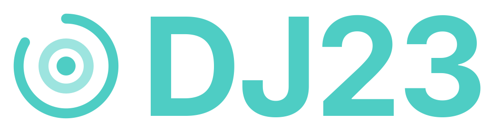

  

  <strong>A two-deck DJ mixer that runs entirely in the browser.</strong> 
  Drop two tracks, catch the beat, ride the crossfader. 
  Be the DJ. Good vibes only. 🎧

  🔊 <strong><a href="https://dj23.netlify.app/">Try DJ23 Live →</a></strong>

## 🚀 Getting started

* Clone, fork or download this repository
* Install dependencies: `npm install`
* Start the development server: `npm run dev`
* Open your browser and go to [localhost:8080](http://localhost:8080)

Drop an audio file onto either deck, or use **Load Track**. Everything is decoded locally
through the Web Audio API.

## 📦 Features

### 🎧 Decks

* **Two independent decks** with drag-and-drop loading, album art and metadata
* **Automatic BPM detection** on load, plus a **TAP** button when a track defeats the analyser
* **Vinyl jog wheel** you can grab to scratch, with mouse or touch, and a **back-spin** button
* **Pitch fader** with selectable range, **pitch bend** buttons and a one-click reset
* **Beat-aligned looping** — set loop IN and OUT, then trim the length with the loop fader
* **Two cue points per deck**, plus a hold-to-preview CUE button
* **Beat navigation** to nudge the playhead exactly one beat back or forward

### 🎛️ Mixing

* **Crossfader**, per-channel volume faders and master volume
* **4-band EQ** per deck (High / Mid / Low / Gain), each with a kill switch and a reset dot
* **Five effects** per deck: filter, reverb, delay, phaser and flanger
* **SYNC** in both directions, matching BPM *and* beat position
* **VU meters** for both decks and the master bus, plus a beat meter for phrase counting
* **Pre-listen** on either deck when output routing is set to cue split

### 🌊 Waveforms

* A **per-deck overview waveform** showing the whole track, with cue point markers — click to seek
* **Beat-matching waveforms** pinned to the top of the screen for both decks at once, so you can
  line up transients visually. Zoom in and out, drag to scratch, and they stay in view while you
  scroll through the rest of the mixer.

### ⚡ Extras

* **Track list** — drag a whole folder onto the page and every track in it shows up with
  its artwork, artist and length, ready to load onto either deck
* **Sound pad** with 9 slots — airhorn, siren, scratch, clap, boom, laser, applause, drop and
  whoosh — and every slot can be replaced with your own audio file
* **Record your mix** as it plays and download it as a WebM file
* **Keyboard shortcuts** for everything you need mid-mix, with a `?` cheat sheet
* **Responsive layout** — so you can even mix from your phone

## ⌨️ Keyboard shortcuts

| | Deck A | Deck B |
| --- | --- | --- |
| Play | <kbd>Q</kbd> | <kbd>U</kbd> |
| Pause | <kbd>W</kbd> | <kbd>I</kbd> |
| Stop | <kbd>E</kbd> | <kbd>O</kbd> |
| Cue (hold) | <kbd>R</kbd> | <kbd>P</kbd> |
| Cue point 1 / 2 | <kbd>1</kbd> <kbd>2</kbd> | <kbd>8</kbd> <kbd>9</kbd> |
| Set cue point 1 / 2 | <kbd>⇧1</kbd> <kbd>⇧2</kbd> | <kbd>⇧8</kbd> <kbd>⇧9</kbd> |
| Pitch bend − / + (hold) | <kbd>A</kbd> <kbd>S</kbd> | <kbd>J</kbd> <kbd>K</kbd> |
| Loop in / out | <kbd>Z</kbd> <kbd>X</kbd> | <kbd>N</kbd> <kbd>M</kbd> |
| Load track | <kbd>⌃O</kbd> | <kbd>⌃P</kbd> |

Global: <kbd>Space</kbd> play/pause the active deck, <kbd>←</kbd> <kbd>→</kbd> crossfader,
<kbd>↑</kbd> <kbd>↓</kbd> master volume, <kbd>⌃S</kbd> sync A to B, <kbd>⌃D</kbd> sync B to A,
<kbd>?</kbd> shortcuts, <kbd>Esc</kbd> close.

## 🌐 Browser support

Needs a modern browser with Web Audio and `ResizeObserver` — recent Chrome, Edge, Firefox or
Safari. Recording uses `MediaRecorder`, which is unavailable in some older Safari versions.

## 🆔 The name

DJ23 is a little tribute to my lovely daughter, Daniela.

The `D` comes from her name, and `23` is the year she was born.

So this one's for her ❤️

## 📃 License

Copyright (c) 2025–ω Marc Anguera Insa. DJ23 is released under the [AGPL-3.0 License](LICENSE).
